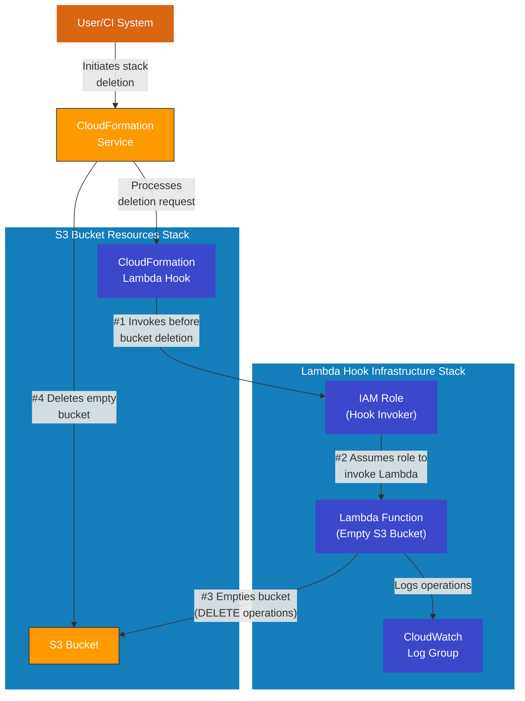

# CloudFormation S3 Auto-Empty Hook

CloudFormation Lambda hook to automatically empty S3 buckets before
deletion.

## Overview

This repository provides a solution to a common AWS CloudFormation
challenge: deleting stacks that contain non-empty S3 buckets.
Normally, CloudFormation cannot delete a bucket that contains
objects, requiring manual intervention to empty the bucket before
stack deletion can succeed.

This solution implements a [CloudFormation Lambda Hook](https://docs.aws.amazon.com/cloudformation-cli/latest/hooks-userguide/lambda-hooks.html)
that automatically empties S3 buckets before CloudFormation attempts to delete them,
enabling fully automated stack deletion.

## How It Works

When you initiate deletion of a CloudFormation stack containing an S3 bucket:

1. CloudFormation triggers the Lambda hook before attempting to delete the bucket
2. The Lambda function empties the bucket by deleting all objects and versions
3. Once empty, CloudFormation proceeds with deleting the bucket itself

## Security Considerations

The Lambda function requires permissions to empty any S3 bucket in
your AWS account. While this is broader than the principle of least
privilege might suggest, the function includes several security
measures:

1. Validation that it's only being called by CloudFormation Hooks
2. Verification that it's only used for DELETE operations
3. AWS account-level restrictions via the `aws:ResourceAccount` condition
4. Limited functionality (can only empty buckets, not access or modify data)

## Architecture

The solution uses a [separation of concerns](https://en.wikipedia.org/wiki/Separation_of_concerns)
approach with two distinct CloudFormation stacks:

1. **Lambda Hook Infrastructure** [lambda-hook-infrastructure.yaml](lambda-hook-infrastructure.yaml):
A long-lived, foundational stack that creates the Lambda function
and IAM roles needed for the hook mechanism. This stack is deployed
once and can be reused across multiple bucket stacks.
2. **S3 Bucket Resources** [s3-bucket-resources.yaml](s3-bucket-resources.yaml): Contains
the actual S3 bucket and the hook configuration that references the
Lambda. This stack can be deployed to multiple environments.



## Components

- **Lambda Function**: Automatically empties S3 buckets by deleting all objects and object versions
- **IAM Role**: Allows CloudFormation to invoke the Lambda function
- **CloudFormation Lambda Hook**: Configures when the Lambda function should be triggered
- - **Note**: The Hook's [Alias property](https://docs.aws.amazon.com/AWSCloudFormation/latest/UserGuide/aws-resource-cloudformation-lambdahook.html#cfn-cloudformation-lambdahook-alias)
 uses the `StackShortName` parameter to create a unique identifier following the required
 pattern `Name1::Name2::Name3`. This parameter must be carefully chosen to ensure the Alias
 meets CloudFormation's naming requirements and **remains unique per account and Region**.
- **S3 Bucket**: Standard S3 bucket with security best practices enabled

- **S3 Bucket**: Standard S3 bucket with security best practices enabled

## Prerequisites

- [AWS CLI](https://docs.aws.amazon.com/cli/latest/userguide/getting-started-install.html) configured with appropriate permissions
- [AWS SAM CLI](https://docs.aws.amazon.com/serverless-application-model/latest/developerguide/install-sam-cli.html) installed
- Python 3.13 or compatible version
- [ruff](https://docs.astral.sh/ruff) tool for Python code linting

## Deployment

The deployment script, [deploy-stacks.sh](deploy-stacks.sh), supports several options:

```bash
# Deploy both stacks
./deploy-stacks.sh

# Deploy only the hook infrastructure
./deploy-stacks.sh --hook-only

# Deploy only the bucket resources
./deploy-stacks.sh --bucket-only

# Use a specific AWS profile
./deploy-stacks.sh --profile prod

# Deploy to a specific region
./deploy-stacks.sh --region us-west-2
```

### Configuration

Edit the [.env](.env) file to customize:

- AWS profile and region
- S3 bucket name prefix
- Hook configuration settings
- Deployment environment tag

## Testing

The repository includes an [upload-test-files.sh](upload-test-files.sh) script to help
test the S3 bucket emptying functionality:

```bash
# Upload test files with multiple versions
./upload-test-files.sh

# Specify a custom bucket
./upload-test-files.sh --bucket my-custom-bucket

# Create more versions (default is 3)
./upload-test-files.sh --iterations 5
```

## Customization

You can customize this solution by:

- Modifying the Lambda function for specific bucket handling logic
- Adding additional validation or notification logic to the emptying process
- Adjusting IAM permissions to be more restrictive if needed

## Comparison with DeletionPolicy

AWS CloudFormation's native `DeletionPolicy` attribute offers alternatives:

- **DeletionPolicy: Retain**: Leaves the bucket intact when the stack is deleted (manual cleanup required)
- **DeletionPolicy: Delete** (Default): Attempts to delete the bucket but fails if it contains objects

This Lambda Hook solution provides automated cleanup while still
performing a complete deletion, combining the best of both approaches.

## License

This project is licensed under the MIT License - see the [LICENSE](LICENSE) file for details.

## Contributing

Contributions are welcome! Please feel free to submit a Pull Request.

